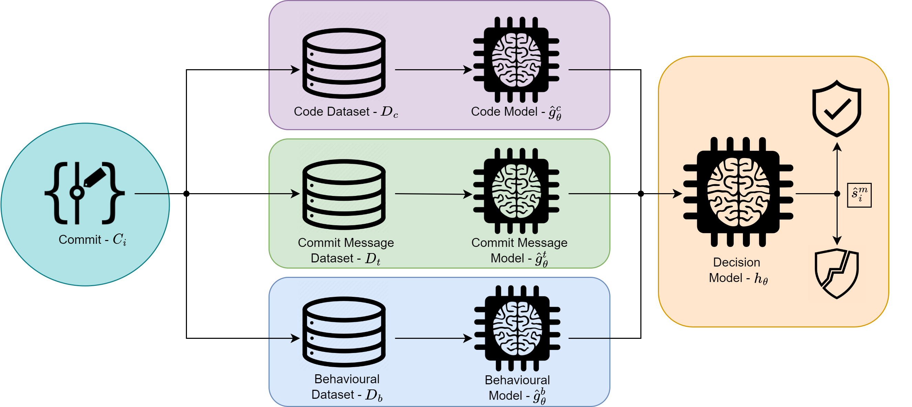

# PatchView

## Intro
This repository contains code for TODO TODO


## Folders
Data: contains the raw datasets and script files for processing the datasets.
Models: contains the models used in the repository.
Results: contains the scripts used to gather the results from W&B and create figures for them.
Sweeps: contains sweep configuartions for W&B.

## Requirements
python 3.10
Pytorch 1.13


## Usage
### Commit Message Model Train
```bash
python main.py --epochs 10 --batch_size 16 --source_model Message --message_model_type roberta --learning_rate 1e-5 --recreate_cache
```

### Behavioural Model Train
```bash
python main.py --activation=tanh  --batch_size=512 --dropout=0.3 --epochs=600 --event_l1=83 --event_l2=41 --event_l3=83 --event_l4=80 --event_window_size=41 --folds=10 --learning_rate=0.0001 --run_fold=7 --source_model=Events
```

### Code Model Train
```bash
python main.py --epochs 100 --learning_rate 1e-5 --dropout 0.8  --recreate-cache --folds 10  --source_model Code  --model_type roberta
```

### Multi-Modality Model Train
```bash
python main.py --epochs 10 --eval_batch_size 16 --train_batch_size 16 -lr 1e-5 --dropout 0.7  --recreate_cache --code_merge_file --source_model Multi
```
